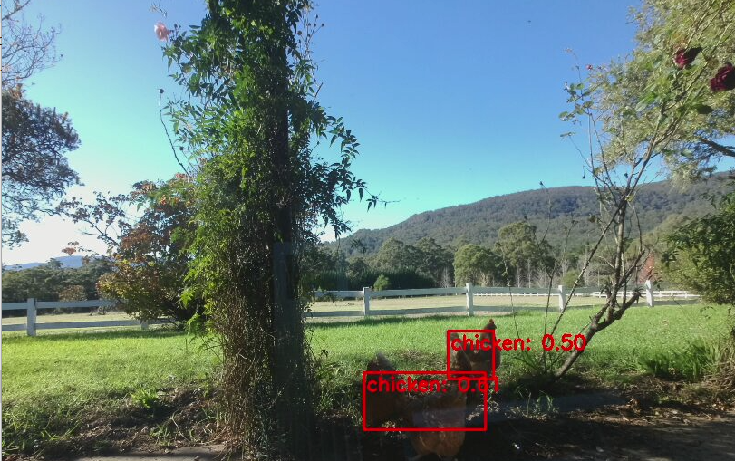
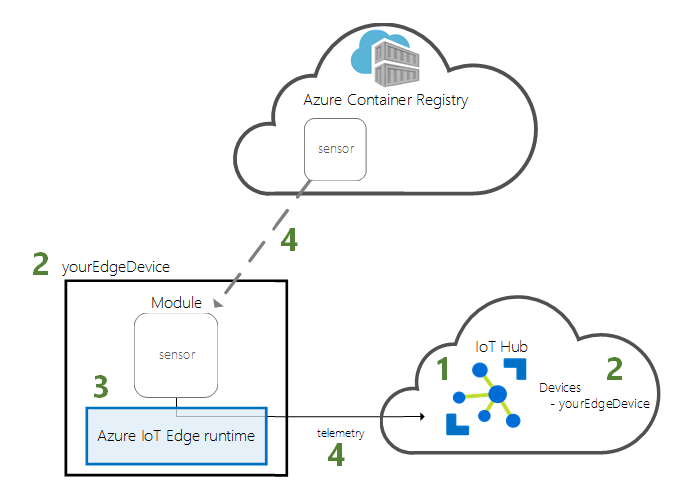
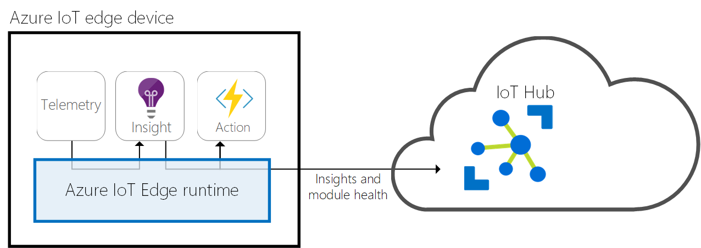

# AI-Conservation

<H1> Exploration of Live Video Analytics in Australian Wildlife Conservation.</H1>

This repository is not complete, it contains simple prototypes that relate to real world problems where technology can be used to create positive outcomes for both Australian business and Australia's endemic wildlife. 

For me, innovation in across this space is an "and-and" not an "and-or" value proposition.

Ideation and collaboration are essential to solving real world problems. When we bring scientists, government and technologists together we create diverse teams which are uniquely able to create innovative solutions.

<H2> Ideas </H2>

Trains and Macrospods should never meet!

Sadly, and daily many Australian Macropods (https://lnkd.in/g72gXM9) which include kangaroos, wallabies, and wallaroos are killed when crossing train lines in rural and regional locations. When these events occur, the trains are required to be inspected and potentially go through costly maintenance and repair. Rather than accept this as an inevitable consequence of moving people and product across our nation, Australian businesses can explore use of edge-based video analytics and AI to see (detect), identity and respond appropriately to what lies ahead.

In this case, the installation a simple sensor to create a sound deterrent (https://lnkd.in/gnAn6Jp) would stop the frequency of these encounters. Solving this type of problem using technology is good for business and good for Australia’s endemic wildlife.

Augmenting phystical things like trains, planes and automobiles with cognitive services and artifical intelligence is powerful.

This is inspired by Microsoft Project15, with a goal to conservation and ecosystem sustainability through use an open platform that brings the latest Microsoft cloud and Internet of Things (IoT) technologies to accelerate scientific teams building solutions like species tracking & observation, poaching prevention, ecosystem monitoring, pollution detection, etc. https://microsoft.github.io/project15/

<H3> Chicken-AI -protoype</H3>
 
The folder contains a docker image, with a trained YOLO model which identifies chickens in a live video stream. 

[26-May-Chickens.avi](26-May-Chickens.avi) recording of an RTSP feed after deploying the first training iteration, which was based on 100 images captured using the [Azure Percept development kit](https://azure.microsoft.com/en-au/pricing/details/azure-percept/#)

Instructions for [deploying the Development Kit](https://docs.microsoft.com/en-us/azure/azure-percept/quickstart-percept-dk-set-up#). 

The [Azure Percept Portal](https://ms.portal.azure.com/#blade/AzureEdgeDevices/Main/overview) is integrated with [CustomVision.AI](https://www.customvision.ai/) , this enables you to automate image capture, label images, train models and then deploy the trained model to the appliance.

You do not need Azure Percept Development Kit to explore and build for Vision on Edge Scenarios [check out this blog post](https://techcommunity.microsoft.com/t5/internet-of-things/bringing-your-vision-ai-project-at-the-edge-to-production-is-now/ba-p/2259359)

<H3> Geese-AI -protoype</H3>
 
The repository contains a trained YOLO model which identifies [Geese](Images/scomo.jpg) in a live video stream.

<H2> All of the above are enabled by Azure IoT Edge </H2>

<H3> Concepts </H3>

[Review the IoT Reference Architecture](https://docs.microsoft.com/en-us/azure/architecture/reference-architectures/iot)

[IoT Hubs](https://docs.microsoft.com/en-us/azure/iot-hub/about-iot-hub) manage devices such as IoT Edge Devices (compute) / IoT Devices (sensors) check out this [quickstart guide](https://docs.microsoft.com/en-us/azure/iot-edge/quickstart-linux). 

[IoT Edge Modules](https://docs.microsoft.com/en-us/azure/iot-edge/iot-edge-modules) are containers, they can be stored in Azure Container registry or other public / private registries and deployed from IoT Hub to IoT Edge Runtime.

 
[IoT Edge Runtime](https://docs.microsoft.com/en-us/azure/iot-edge/iot-edge-runtime) consists of the [edgeHub](https://docs.microsoft.com/en-us/azure/iot-edge/iot-edge-runtime#iot-edge-hub) and [edgeAgent](https://docs.microsoft.com/en-us/azure/iot-edge/iot-edge-runtime#iot-edge-agent).

Following this [tutorial](https://docs.microsoft.com/en-us/azure/iot-edge/module-composition) to learn how to deploy modules and establish routes in IoT Edge.
 
IoT Edge Modules can operate [offline](https://docs.microsoft.com/en-us/azure/iot-edge/iot-edge-modules#offline-capabilities) after syncing at least once with IoT Hub. You cannot however create, delete or update IoT Edge modules that are running on an IoT Edge when it is disconnected. [Inter Module communication](https://docs.microsoft.com/en-us/azure/iot-edge/iot-edge-runtime#module-communication) is configured using routing statements (data input and output)  and can include routing back to IoT Hub for use other Azure Services.
 
Outside of deploying modules to IoT Edge you may also need to configure the Edge compute's Port Bindings using [Container Create](https://docs.microsoft.com/en-us/azure/iot-edge/how-to-use-create-options) options:
1.	[Give modules access to host storage](https://docs.microsoft.com/en-us/azure/iot-edge/how-to-access-host-storage-from-module)
2.	[Map host port to module port](https://docs.microsoft.com/en-us/azure/iot-edge/how-to-use-create-options#map-host-port-to-module-port)
 
Binding Tip
For example, on a Linux system, "Binds":["/etc/iotedge/storage/:/iotedge/storage/"] means the directory /etc/iotedge/storage on your host system is mapped to the directory /iotedge/storage/ in the container. 
 
You can deploy so many Azure Services as container modules to IoT Edge:
1. 	[Azure Functions](https://docs.microsoft.com/en-us/azure/iot-edge/tutorial-deploy-function)
2. 	[Azure Stream Analytics](https://docs.microsoft.com/en-us/azure/iot-edge/tutorial-deploy-stream-analytics)
3.	[SQL Server (Time Series Insights) and SQL DB Edge](https://docs.microsoft.com/en-us/azure/iot-edge/tutorial-store-data-sql-server)

The [MSFT container repository can be found here](https://github.com/microsoft/containerregistry/blob/master/docs/dockerhub-to-mcr-repo-mapping.md)
